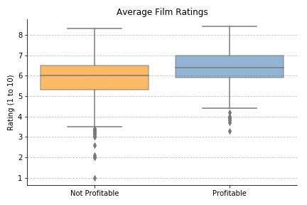
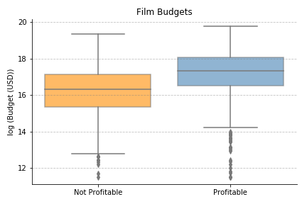
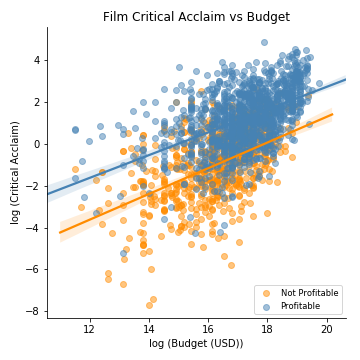

# Film Success Analysis
## Summary
* The project brings in data from [The Movie Database API](https://developers.themoviedb.org/3/getting-started/introduction), cleans the data, and analyzes the factors that make films successful
* The following conclusions can be drawn from the analysis:
    * On average, profitable films have higher ratings than unprofitable films
    * On average, profitable films have higher budgets than unprofitable films
    * Film budget is positively correlated with level of critical acclaim
#### How to Reproduce the Analysis
1. Enter [The Movie Database API](https://developers.themoviedb.org/3/getting-started/introduction) key into the "api_keys.py" file
2. Run the "data_cleanup.ipynb" file to pull data from the API, clean the data, and export the cleaned data into a new CSV file
3. Run the "analysis.ipynb" to reproduce the analysis
#### Files
* The [api_keys.py](https://github.com/mileslucey/movies_success_analysis/blob/master/api_keys.py) file is a Python file that contains the API key used in the analysis. The current API key must be replaced in order for the analysis to run
* The [data_cleanup.ipynb](https://github.com/mileslucey/movies_success_analysis/blob/master/data_cleanup.ipynb) file is a Jupyter Notebook file that pulls in data from the API, cleans the data, and exports the data into a new CSV file
* The [Analysis.ipynb](https://github.com/mileslucey/movies_success_analysis/blob/master/analysis.ipynb) file is a Jupyter Notebook file that analyzes the data
* All PNG files in the [Figures folder](https://github.com/mileslucey/movies_success_analysis/tree/master/Figures) are images of the graphs that the "Analysis.ipynb" file generates
* All CSV files in the [Output folder](https://github.com/mileslucey/movies_success_analysis/tree/master/Output) are the datasets that the "data_cleanup.ipynb" file generates
## [Data Extraction and Cleaning](https://github.com/mileslucey/movies_success_analysis/blob/master/data_cleanup.ipynb)
* A list of film IDs found on [Kaggle](https://www.kaggle.com/tmdb/tmdb-movie-metadata) is used to pull fresh data from [The Movie Database API](https://developers.themoviedb.org/3/getting-started/introduction)
* Data is cleaned in the following ways:
   * Date columns are converted to datetime format
   * The dataset contains a few rows with N/A'd metrics. These rows only make up a small percentage of the data so all rows with N/As are removed
   * Movies shorter than one hour and longer than four hours generally represent films that are too different than those in the rest of the dataset. Therefore, films shorter than one hour and longer than four hours are removed
   * Films with budgets less than $100,000 are either very old or are not films that many people commonly see and are thus too different from films in the rest of the dataset. Therefore, films with budgets less than $100,000 are removed
   * All films that have 0 reviews are removed from the analysis
   * Films released before the internet age generally have much fewer reviews than films released during the internet age. To prevent there from being inherent bias against older films, only movies released after 2005 are included in this analysis
#### Calculated Metrics
* A film's "profit" is calculated as: "revenue" - "budget"
   * "Profitable" films are films with "profit" greater than $0 and "not profitable" films are films with "profit" less than or equal to $0
* A film's "critical acclaim" is calculated as: ("average film rating score" * "quantity of reviews") / ("days since film's release")
#### Logarithmic Transformations
* Several metrics used in the analysis are right-skewed. In order to ensure that distributions approximate normality and to minimize variances between the studied groups, the following metrics are transformed into a log scale:
   * Budget
   * Critical acclaim
## [Analysis](https://github.com/mileslucey/movies_success_analysis/blob/master/analysis.ipynb)
#### Question 1: Do profitable movies tend to have higher or lower average review scores (on a scale of 1 to 10) than unprofitable movies?
* A two-tailed two-sample t-test yields statistically significant results at the 95% significance level (p-value < 0.025). On average profitable films have higher ratings than unprofitable films
* A Welch's test confirms the results found in the two-tailed two-sample t-test

#### Question 2: Do profitable movies tend to have higher or lower budgets than unprofitable movies?
* A two-tailed two-sample t-test yields statistically significant results at the 95% significance level (p-value < 0.025). On average profitable films have higher budgets than unprofitable films
* A Welch's test confirms the results found in the two-tailed two-sample t-test

#### Question 3: Does film budget impact level of critical acclaim?
* A single variable regression shows that film budget is positively correlated with level of critical acclaim. This means that films with larger budgets tend to have more critical acclaim

## Analysis Weaknesses and Opportunities for Further Research
* The initial dataset is created from a list of film IDs from an existing [Kaggle dataset](https://www.kaggle.com/tmdb/tmdb-movie-metadata). It is unclear how this list of IDs in the Kaggle dataset was initially gathered so it may not be a random sample
* The analysis studies the difference between films with positive profit versus films with 0 or negative profit. This could be misleading because films with close to 0 profit are included in both groups.
* The analysis covers films with a broad range of budgets ($100K and up). It could be interesting to explore differences in budget ranges because a film with a $100K budget is likely very different than a film with a $300M budget
* The single variable regression only explains about 25% of the variation in the dependent variable (log critical acclaim). It could be that adding more variables to the model would help it yield more significant results

